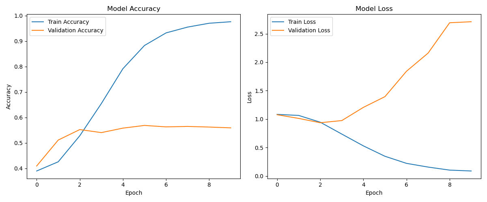

# 🐦 Arabic Tweet Sentiment Analysis

[](https://www.python.org/)
[](https://www.tensorflow.org/)

This repository contains a project for **Arabic Tweet Sentiment Analysis** using a **Bidirectional LSTM (BiLSTM)** neural network. It includes **preprocessing**, **tokenization**, **model training**, and **visualization** of results.  

The project demonstrates an end-to-end workflow for sentiment analysis on Arabic text.

---

## 🌟 Table of Contents
- [Project Overview](#project-overview)  
- [Dataset](#dataset)  
- [Requirements](#requirements)  
- [Project File Structure](#file-structure)  
- [Data Preprocessing](#data-preprocessing)  
- [Model Architecture](#model-architecture)  
- [Training](#training)  
- [Evaluation & Visualization](#evaluation--visualization)  
- [Usage](#usage)  
- [Contributing](#contributing)  
- [References](#references)  

---

## 📝 Project Overview
This project focuses on **Arabic sentiment analysis**. Tweets are classified into three categories:  

- **Positive** ✅  
- **Negative** ❌  
- **Neutral** ⚪  

Main steps:  

1. Cleaning and preprocessing Arabic tweets  
2. Tokenizing and padding sequences  
3. Building and training a BiLSTM model  
4. Evaluating and visualizing model performance  

---

## 📂 Dataset
The project uses the **SemEval2017 Arabic Twitter Dataset**, containing tweets labeled with sentiment:  

- `SemEval2017-train.txt` → Training data  
- `SemEval2017-test.txt` → Testing data  

> Place the dataset in the project directory before running preprocessing.

---

## 🛠 Requirements
Python libraries required:

```bash
numpy
pandas
nltk
tensorflow
scikit-learn
matplotlib

```

## 📁 Project File Structure

```
├── data_preprocessing.py      # Preprocess Arabic tweets
├── BiLSTM.py                  # Build, train, and evaluate BiLSTM model
├── SemEval2017-train.txt      # Training dataset
├── SemEval2017-test.txt       # Testing dataset
├── X_train.npy                # Preprocessed training sequences
├── X_test.npy                 # Preprocessed testing sequences
├── Y_train.npy                # Training labels
├── Y_test.npy                 # Testing labels
├── tokenizer.npy              # Tokenizer word index
└── README.md                  # Project documentation

```

## 🧹 Data Preprocessing

The preprocessing script (`data_preprocessing.py`) performs the following steps to clean and prepare Arabic tweets for modeling:

1. **Remove mentions, URLs, hashtags, punctuation, digits, and English letters**  
   - Cleans tweets from unnecessary symbols and characters.

2. **Normalize Arabic text**  
   - Converts different forms of alef (إ، أ، آ) to a standard form (ا)  
   - Converts other variations (ى → ي, ة → ه, گ → ك).

3. **Remove diacritics and repeated characters**  
   - Cleans text from tashkeel and repeated letters to reduce noise.

4. **Apply stemming using ISRIStemmer**  
   - Reduces words to their root forms to improve model generalization.

5. **Encode sentiment labels and one-hot encode them**  
   - Maps `positive`, `negative`, and `neutral` to numeric values.  
   - Converts labels to one-hot vectors for the neural network.

6. **Tokenize and pad sequences**  
   - Converts text into sequences of integers using `Tokenizer`.  
   - Pads sequences to a fixed length for input to the BiLSTM model.

7. **Split data into training and testing sets**  
   - Uses `train_test_split` to separate data for training and evaluation.

8. **Save processed data as `.npy` files**  
   - Saves `X_train`, `X_test`, `Y_train`, `Y_test`, and `tokenizer` for later use in model training.

> Example usage:

```python
python data_preprocessing.py

```

## 🏗 Model Architecture

The BiLSTM model (`BiLSTM.py`) is designed for **Arabic tweet sentiment analysis**. It consists of several layers to process and classify text sequences effectively:

### Layers Overview

1. **Embedding Layer**  
   - Converts tokens (integers) into dense vector representations.  
   - Helps the model understand semantic relationships between words.

2. **Bidirectional LSTM Layer**  
   - Reads sequences in both forward and backward directions.  
   - Captures context from **past and future words** in the tweet.

3. **Global Max Pooling**  
   - Reduces the sequence dimension by selecting the most important features.  
   - Helps reduce overfitting and computational complexity.

4. **Fully Connected Layers (Dense Layers)**  
   - Multiple dense layers with **ReLU activation**.  
   - Includes **dropout** to prevent overfitting.

5. **Output Layer**  
   - **Softmax activation** for predicting the probability of each class:  
     - Positive ✅  
     - Negative ❌  
     - Neutral ⚪  

---

### Hyperparameters

| Parameter            | Value        |
|---------------------|-------------|
| Embedding dimension  | 100         |
| LSTM units           | 100         |
| Dropout rate         | 0.5         |
| Vocabulary size      | 20,000      |
| Sequence length      | 500         |

> The architecture is optimized for short Arabic tweets and can be easily adapted for larger datasets or different sequence lengths.

## 🚀 Model Training

The BiLSTM model is trained on the preprocessed Arabic tweets using the following setup:

### 1️⃣ Compile the Model
- **Optimizer:** `Adam`  
- **Loss Function:** `categorical_crossentropy`  
- **Metrics:** Accuracy  

> Compiling prepares the model for training by specifying how it will update weights and measure performance.

### 2️⃣ Train the Model
- **Batch size:** 50  
- **Epochs:** 10  
- **Validation:** Performed on the test set (`X_test` and `Y_test`)  

> Example training code:

```python
history = model.fit(
    X_train, Y_train,
    epochs=10,
    batch_size=50,
    validation_data=(X_test, Y_test)
)

```

## 📊 Evaluation & Visualization

After training, the BiLSTM model’s performance is evaluated and visualized to understand how well it learned to classify Arabic tweets.

### 1️⃣ Accuracy Curves
- Plots **training accuracy** vs **validation accuracy** over epochs.  
- Helps identify overfitting or underfitting.  

### 2️⃣ Loss Curves
- Plots **training loss** vs **validation loss** over epochs.  
- Useful to see if the model is converging properly.  

### 3️⃣ Example Output
> Example placeholder for accuracy and loss plots:



> Replace the placeholder with actual plots generated by `Matplotlib` after running the training script.

### 4️⃣ Tips
- Large gaps between training and validation curves may indicate **overfitting**.  
- Consistently high loss may suggest **learning rate adjustment** or **more data preprocessing** is needed.

## ⚡ Usage

Follow these steps to run the Arabic Tweet Sentiment Analysis project:

### 1️⃣ Preprocess the Data
Clean and prepare the tweets for modeling:

```bash
python data_preprocessing.py

```

### 2️⃣ Train the BiLSTM Model

After preprocessing the data, you can train the BiLSTM model using the following command:

```bash
python BiLSTM.py

```

## 🤝 Contributing

We welcome contributions to improve this project! You can help by:

- **Enhancing Preprocessing:** Improve text cleaning, normalization, or stemming for Arabic tweets.  
- **Experimenting with Model Architectures:** Try different neural networks, hyperparameters, or layers to boost performance.  
- **Expanding Dataset Support:** Add more datasets or support for other languages.  

> Please ensure any contributions follow clean coding practices and include clear documentation.

## 📚 References

- **[SemEval2017 Arabic Twitter Dataset](https://alt.qcri.org/semeval2017/task4/)**  
  Official dataset used for Arabic tweet sentiment analysis.  

- **[ISRI Stemmer in NLTK](https://www.nltk.org/_modules/nltk/stem/isri.html)**  
  Tool used for stemming Arabic words during preprocessing.  

- **[Understanding Bidirectional LSTM for NLP](https://colah.github.io/posts/2015-08-Understanding-LSTMs/)**  
  Reference article explaining the BiLSTM architecture and its applications in NLP.  
